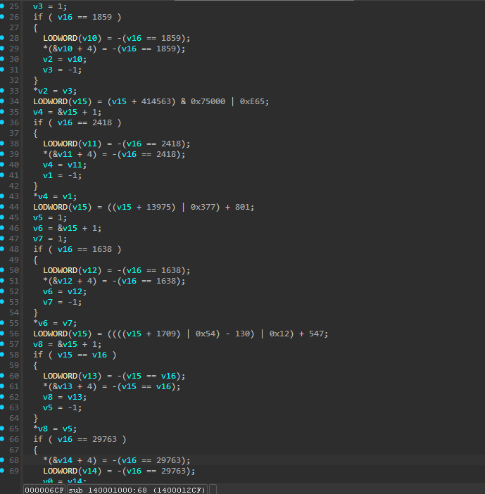
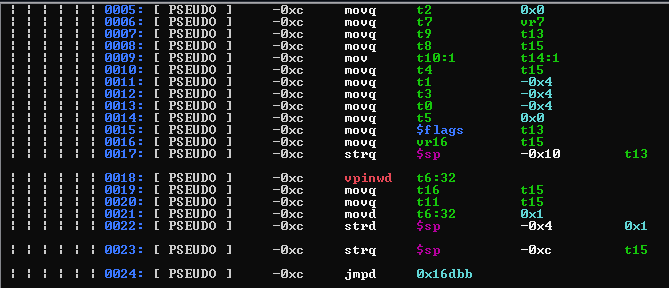

# binaryshield-devirtualizer PoC

This project is a **static devirtualizer** designed to analyze and solve a crackme protected by the open-source code virtualizer **BinaryShield**.

This VM has no mutation or extra obfuscation in it. It can be analyzed without recovering the whole function and with only architechture-specific disassembly.

I wanted to go further than just obtaining the flags. My goal was to push my skills, learn deobfuscation/devirtualization techniques better and compare LLVM and VTIL to see which one is better for the job.

## Technologies Used

- **LLVM** for lifting and analysis  
- Experimental support for **VTIL** (results were not satisfactory)
- **Zydis** as disassembly engine
- **LIEF** for binary operations

## Results

- **LLVM** successfully devirtualized the function, allowed us to recover the flags and analyze the logic. It was able to recompile back to x64.
- **VTIL** failed to produce acceptable results due to its outdated state. Unable for proper recompilation.

## Note

This project is for research and educational purposes only.

## Screenshots

